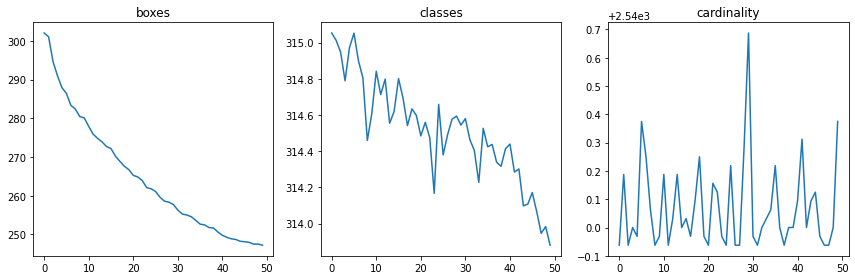

## ConvMixer as a backbone for object detection

Dataset : https://www.kaggle.com/datasets/thomasflahault/42aivision

TODO:
- Implementation of the mAP-50
- Data augmentation

##

	
	
First 50 iterations

